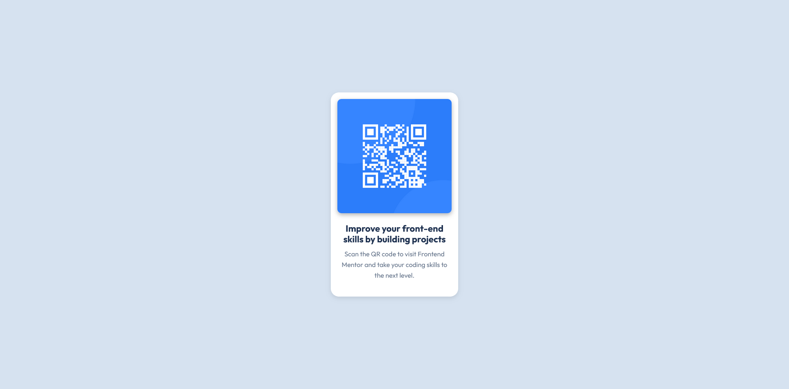

# QR Code Component

**A sleek and modern QR code component built using Angular and SASS.**

This project is part of a larger effort to continuously improve frontend development skills by creating real-world projects. It demonstrates clean and minimal UI design, focusing on the implementation of reusable components and adherence to best practices in modern frontend development.

## Features

- Built with **Angular** for scalable and maintainable component-based architecture.
- Styled using **SASS** to take advantage of variables, nesting, and other advanced CSS features.
- Implements a static card layout for showcasing a QR code, adhering closely to the design specifications provided.
- Clean, simple, and responsive design optimized for both desktop and mobile views.

## Screenshot

Here is a preview of the QR Code Component:



## Technologies Used

- **Angular** - A powerful JavaScript framework for building component-driven web applications.
- **SASS** - A CSS preprocessor that adds useful features like variables and mixins, making styling more efficient and maintainable.
- **HTML5** - Semantic structure for content and layout.
- **CSS3** - Styled with modern CSS techniques for a sleek, polished UI.

## Project Structure

The project is organized following a modular and scalable approach:

`/src ├── app │ ├── components │ │ └── qr-code │ │ ├── qr-code.component.html │ │ ├── qr-code.component.scss │ │ └── qr-code.component.ts ├── styles │ └── main.scss ├── assets │ └── images`

## Setup and Installation

To run this project locally:

#### 1. Clone the repository:
```bash
git clone https://github.com/kellenkjames/qr-code-component.git
```
#### 2. Navigate to the project directory:
```bash
cd qr-code-component
```

#### 3. Install the dependencies:
```bash
npm install
```

#### 4. Start the Angular development server:
```bash
ng serve
```

The project will be available on `http://localhost:4200`.

## Design Reference

This QR code component was designed to closely match the design specifications provided. The design assets, including images and color palette, can be found in the `/images` and `style-guide.md` files, respectively.

## Deployment

The project can be deployed using any modern hosting platform. Recommended platforms include:

- **GitHub Pages**
- **Vercel**
- **Netlify**

## Future Enhancements

- Add animations and transitions for a more dynamic user experience.
- Implement accessibility improvements to ensure compliance with WCAG standards.
- Refactor the component into reusable subcomponents for potential future extensions.

## License

This project is open-source and available under the [MIT License](LICENSE).
